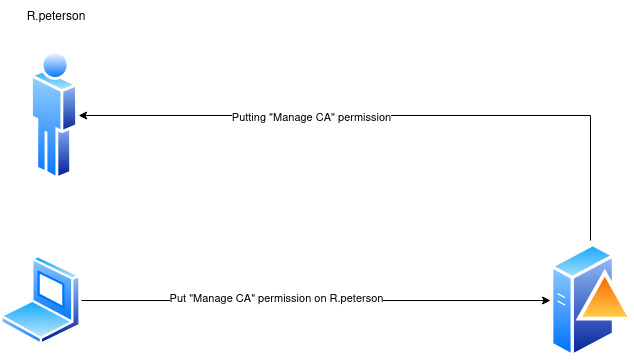
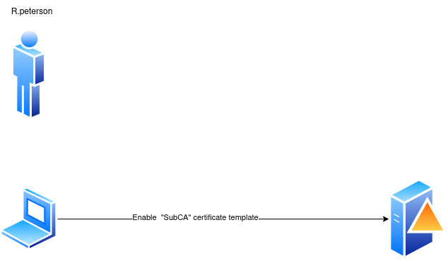
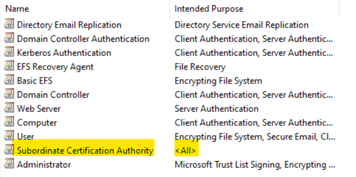
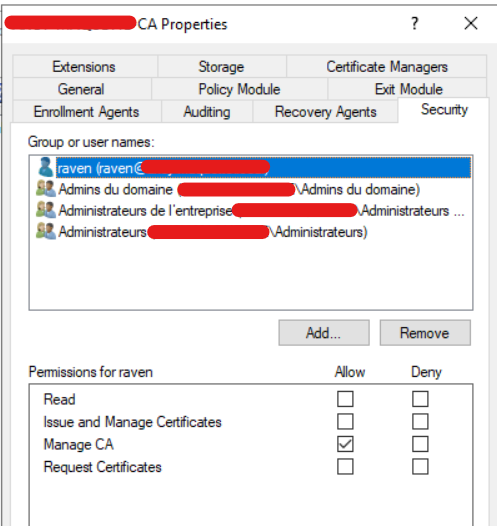
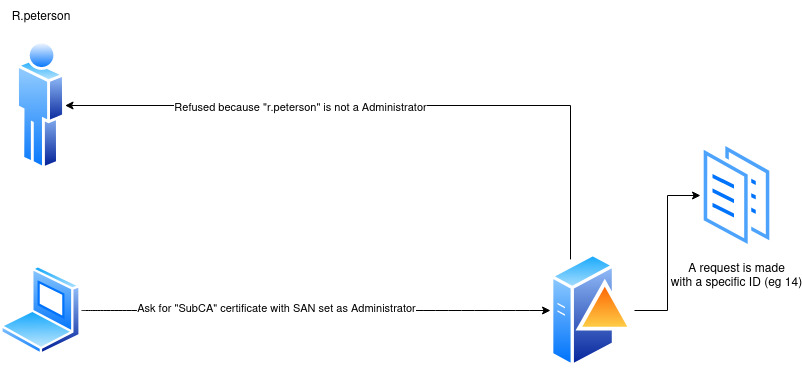
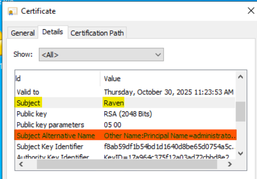
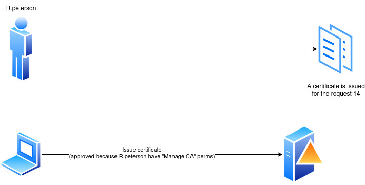
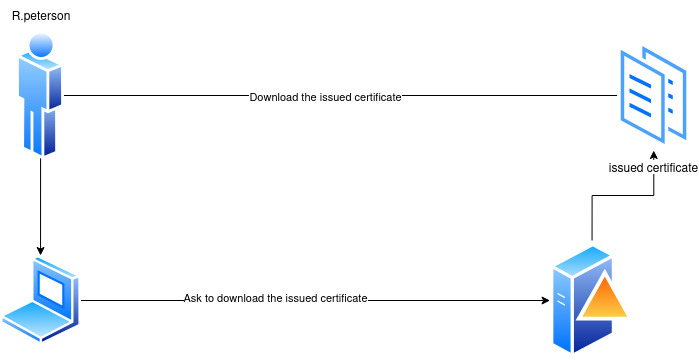
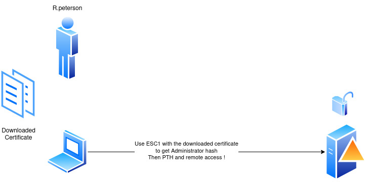

## DirtyCertificate

DirtyCertificate is a tool to automate the "chained" vulnerabilities ESC7 (Vulnerable Certificate Authority Access Control) and ESC 1 (Misconfigured Certificate Templates - ESC1).

https://github.com/Vict0rin0x/DirtyCertificate/assets/66214351/1ca3e8ae-5aea-4969-8c94-66cb0c884056

## Requirements and installation

Install dependencies : 

```
pip install rich
pip install certipy-ad
pip install argparse
sudo apt install evil-winrm
sudo apt install ntpsec-ntpdate
git clone https://github.com/Vict0rin0x/DirtyCertificate.git
```

## Usage

```
python3 DirtyCertificate.py -dc_ip <dc_ip> -ca <CA_NAME> -username <USER_WITHOUT_DOMAIN> -password <PASSWORD> -domain <DOMAIN>  -impersonate <ACCOUNT_TO_IMPERSONATE> -v (verbosity)
```

## How it works

### Step 1 : Exploit ESC7 to get "Manage CA" permissions 



The user that is used in here needs to have "Manage CA" permissions. Otherwise, the script will fail. 


### Step 2 : Enable the vulnerable "SubCA" certificate template



By default, when installing a ADCS, a template called "SubCA" is created. This one is vulnerable to ESC1, but only Administrators can enroll to it. All roles are enabled, **including the `Client Authentication` that we need.



**By default, the permissions of the user used for this exploit is `Manage CA`**. 



### Step 3 : Request a "SubCA" certificate exploiting ESC1 



**ESC1 is a vulnerability that consists in providing a SAN (Subject Alternative Name) that is used for authentication.** When a certificate issued by lets say "R.peterson", **but with a SAN with the value "administrator"**, it is possible to request a TGT **containing the NTLM hash of the administrator account.** 



Here we can see the difference between the `subject` (which, in this case is `raven`) and the Subject Alternative Name (which is `administrator`)

We issue a `SubCA`certificate, but remember, we dont have the rights to enroll to it. So, **the ADCS creates a request ID which corresponds to the failed request**

The error should appears like that : 

```
[-] Got error while trying to request certificate: code: 0x80094011 - CERTSRV_E_ENROLL_DENIED - The permissions on this CA do not 
allow the current user to enroll for certificates.
[*] Request ID is X
```

### Step 4 : Issue the requested certificate



We have the `ManageCA`, it is possible to **approve and issue** the failed certificate. 

During this step, the user used for this exploit gains the `Issue Certificate` permissions. This is possible **because we have the `ManageCA` permissions in the first place.**

### Step 5 : Download the issued certificate



We can download the issued certificate.

### Step 6 : Use the downloaded certificate to authenticate as Administrator 



Using the downloaded certificate, it is possible to 

1. Ask a TGT corresponding to the user `administrator`
2. Get the corresponding NTLM hash of the user `administrator`.
3. Using the NTLM, we can perform a PTH (Pass The Hash) to authenticate as `administrator` 


